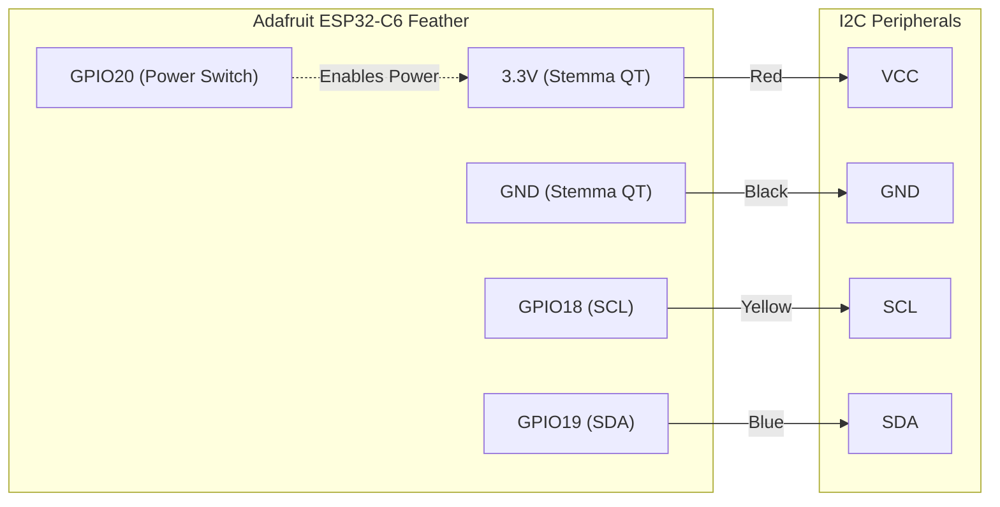

# adafruit-feather-esp32c6-discovery
This project explores the [Adafruit ESP32-C6 Feather](https://www.adafruit.com/product/5933) board using Rust. It provides a set of working examples adapted specifically for this hardware. The `main.rs` firmware is designed to closely mimic the behavior of the [Factory Reset Example](https://learn.adafruit.com/adafruit-esp32-c6-feather/factory-reset) that the Adafruit ESP32-C6 Feather ships with natively.

## Hardware


## Documentation
- [Primary Guide: Adafruit ESP32-C6 Feather](https://learn.adafruit.com/adafruit-esp32-c6-feather)
- [Adafruit Feather ESP32-C6 PrettyPins](https://github.com/adafruit/Adafruit-ESP32-C6-Feather-PCB/blob/main/Adafruit%20Feather%20ESP32-C6%20PrettyPins%202.pdf)

## Examples

### bme280_ssd1306_i2c

Reads temperature, humidity, and atmospheric pressure from an Adafruit BME280 sensor and displays the formatted values on a generic SSD1306 (128x64) OLED screen.

```bash
cargo run --example bme280_ssd1306_i2c
```

**Hardware:**

- Sensor: Adafruit BME280 Temperature Humidity Pressure Sensor
- Display: Generic SSD1306 (128x64) OLED screen
- Connection: Qwiic/STEMMA QT cable (plug and play I2C connection)

**Wiring with Qwiic/STEMMA QT:**

Simply connect the Qwiic/STEMMA QT cable between the board and peripherals!

```text
Peripherals -> Adafruit ESP32-C6 Feather
-----------    -------------------------
GND (black) -> GND (Stemma GND)
VCC (red)   -> 3.3V (Stemma V+)
SCL (yellow)-> GPIO 18 (Stemma SCL)
SDA (blue)  -> GPIO 19 (Stemma SDA)
```



**I2C Addresses:**

- SSD1306: Auto-detects `0x3C` (default) with failover to `0x3D`
- BME280: Auto-detects `0x77` (Adafruit default) with failover to `0x76`

**Features:**

- Dynamic 3.3V power toggling via `GPIO 20` to activate the Stemma QT port
- I2C bus scanning on initialization
- SSD1306 `embedded-graphics` display rendering
- Fallback address detection for both the display and the environment sensor

**Output:** Formatted Temperature in °C, humidity in %, and atmospheric pressure in hPa rendered directly to the OLED screen.
