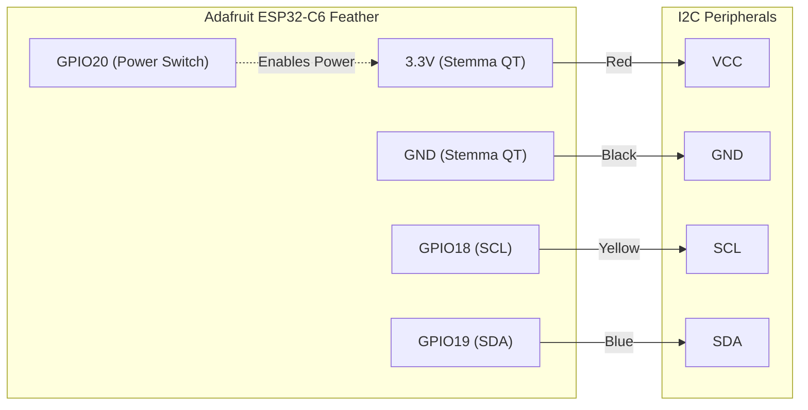

# adafruit-feather-esp32c6-discovery
This project explores the [Adafruit ESP32-C6 Feather](https://www.adafruit.com/product/5933) board using Rust. It provides a set of working examples adapted specifically for this hardware. The `main.rs` firmware is designed to closely mimic the behavior of the [Factory Reset Example](https://learn.adafruit.com/adafruit-esp32-c6-feather/factory-reset) that the Adafruit ESP32-C6 Feather ships with natively.

## Hardware


## Documentation

- [Primary Guide: Adafruit ESP32-C6 Feather](https://learn.adafruit.com/adafruit-esp32-c6-feather)
- [Adafruit Feather ESP32-C6 PrettyPins](https://github.com/adafruit/Adafruit-ESP32-C6-Feather-PCB/blob/main/Adafruit%20Feather%20ESP32-C6%20PrettyPins%202.pdf)

## Examples

The examples are grouped by the communication protocol they use.

---

### I2C Examples

The standard I2C pins for the Adafruit Feather ESP32-C6 (SCL: IO18, SDA: IO19 as per the STEMMA QT / Qwiic connector) are used for these examples.

#### bme280_ssd1306_i2c

Reads temperature, humidity, and atmospheric pressure from an Adafruit BME280 sensor and displays the formatted values on a generic SSD1306 (128x64) OLED screen.

```bash
cargo run --example bme280_ssd1306_i2c
```

**Hardware:**

- Sensor: Adafruit BME280 Temperature Humidity Pressure Sensor
- Display: Generic SSD1306 (128x64) OLED screen
- Connection: Qwiic/STEMMA QT cable (plug and play I2C connection)

**Wiring with Qwiic/STEMMA QT:**

Simply connect the Qwiic/STEMMA QT cable between the board and peripherals!

```text
Peripherals -> Adafruit ESP32-C6 Feather
-----------    -------------------------
GND (black) -> GND (Stemma GND)
VCC (red)   -> 3.3V (Stemma V+)
SCL (yellow)-> GPIO 18 (Stemma SCL)
SDA (blue)  -> GPIO 19 (Stemma SDA)
```



**I2C Addresses:**

- SSD1306: Auto-detects `0x3C` (default) with failover to `0x3D`
- BME280: Auto-detects `0x77` (Adafruit default) with failover to `0x76`

**Features:**

- Dynamic 3.3V power toggling via `GPIO 20` to activate the Stemma QT port
- I2C bus scanning on initialization
- SSD1306 `embedded-graphics` display rendering
- Fallback address detection for both the display and the environment sensor

**Output:** Formatted Temperature in °C, humidity in %, and atmospheric pressure in hPa rendered directly to the OLED screen.

#### bme280_i2c

Reads temperature, humidity, and atmospheric pressure from an Adafruit BME280 sensor and prints the values to the console.

```bash
cargo run --example bme280_i2c
```

**Hardware:**

- Sensor: Adafruit BME280 Temperature Humidity Pressure Sensor
- Connection: Qwiic/STEMMA QT cable (I2C)

#### sths34pf80_i2c

Reads presence, motion, and raw IR intensity data from an Adafruit STHS34PF80 IR Presence / Motion sensor and prints the values to the console.

- **Presence & Motion:** These are algorithm-processed scores (signed 16-bit integers). Large positive or negative values indicate high activity or strong presence detection.
- **Raw Obj IR Intensity:** This is the unscaled infrared radiant power seen by the sensor (register `0x26`). It fluctuates based on micro-changes in the heat signature of objects in view.
- **Note:** This version of the example focuses on raw data. Real-time Ambient Temperature (register `0x28`) is currently not exposed by the version of the Rust crate being used.

```bash
cargo run --example sths34pf80_i2c
```

**Hardware:**

- Sensor: [Adafruit STHS34PF80 IR Presence / Motion Sensor](https://www.adafruit.com/product/6426)
- Connection: Qwiic/STEMMA QT cable (I2C)

**Expected Output:**

```text
[INFO ] Presence: 152 | Motion: -24 | Raw Obj IR: 2989 (Intensity)
[INFO ] Presence: 562 | Motion: 392 | Raw Obj IR: 2568 (Intensity)
[INFO ] Presence: 572 | Motion: 390 | Raw Obj IR: 2459 (Intensity)
```

#### sths34pf80_full

Full-featured example for the STHS34PF80 sensor that matches Adafruit's Arduino driver output. It performs manual I2C register reads to access Ambient Temperature and Compensated Object data.

**Understanding the Values:**

- **Amb:** Real-time Ambient Temperature in °C.
- **Pres & Mot:** Algorithm-processed Presence and Motion scores.
- **Obj:** Raw IR Intensity (unscaled).
- **Comp:** Compensated Object IR Intensity.

```bash
cargo run --example sths34pf80_full
```

**Hardware:**

- Sensor: Adafruit STHS34PF80 IR Presence / Motion Sensor
- Connection: Qwiic/STEMMA QT cable (I2C)

**Expected Output:**

```text
[INFO ] Amb: 23.64°C | Pres: 1536 | Mot: 0 | Obj: 7849 | Comp: 7849
[INFO ] Amb: 23.68°C | Pres: 1536 | Mot: 0 | Obj: 7805 | Comp: 7805
[INFO ] Amb: 23.59°C | Pres: 1536 | Mot: 0 | Obj: 7912 | Comp: 7912
```

#### ssd1306_i2c

Draws a 1-bit black and white image (64x64 pixels) on a 128x64 SSD1306 OLED screen over I2C.

```bash
cargo run --example ssd1306_i2c
```

**Hardware:**

- Display: Generic SSD1306 (128x64) OLED screen
- Connection: Qwiic/STEMMA QT cable (I2C)

#### ssd1306_i2c_text

Demonstrates drawing text and shapes on a 128x64 SSD1306 OLED screen over I2C.

```bash
cargo run --example ssd1306_i2c_text
```

**Hardware:**

- Display: Generic SSD1306 (128x64) OLED screen
- Connection: Qwiic/STEMMA QT cable (I2C)

---

### SPI Examples

These examples use the hardware SPI bus of the ESP32-C6.

#### gc9a01_spi

Draws images on a 240x240 round GC9A01 display over SPI.

```bash
cargo run --example gc9a01_spi
```

**Hardware:**

- Display: UNI128-240240-RGB-7-V1.0 (GC9A01 controller)
- Connection: Hardware SPI

**Wiring for Adafruit Feather ESP32-C6:**

```text
GC9A01 Pin  ->  Feather ESP32-C6 (Hardware SPI)
----------      ----------------------------------
VCC         ->  3V
GND         ->  GND
SCL         ->  IO21 (SCK)
SDA         ->  IO22 (MOSI)
DC          ->  IO6  (A2)
CS          ->  IO7  (D7)
RST         ->  IO5  (A3)
```

#### gc9a01_spi_text

Demonstrates drawing text and shapes on a 240x240 round GC9A01 display over SPI.

```bash
cargo run --example gc9a01_spi_text
```

**Hardware:**

- Display: UNI128-240240-RGB-7-V1.0 (GC9A01 controller)
- Connection: Hardware SPI (Same wiring as `gc9a01_spi`)

#### ili9341_spi

Displays a 320x240 image (Mocha) on the ILI9341 2.2" TFT LCD display.


```bash
cargo run --example ili9341_spi
```

**Hardware:**

- Display: [Adafruit 2.2" 18-bit color TFT LCD display with microSD card breakout - EYESPI Connector](https://www.adafruit.com/product/1480)
- Connection: Hardware SPI

#### ili9341_spi_text

Demonstrates drawing text and shapes on a 240x320 ILI9341 display.

```bash
cargo run --example ili9341_spi_text
```

**Hardware:**

- Display: [Adafruit 2.2" 18-bit color TFT LCD display](https://www.adafruit.com/product/1480)
- Connection: Hardware SPI

#### zermatt_snow

Full-screen Zermatt image with physics-based falling snow effect.


```bash
cargo run --example zermatt_snow
```

**Hardware:**

- Display: [Adafruit 2.2" 18-bit color TFT LCD display](https://www.adafruit.com/product/1480)
- Connection: Hardware SPI

#### max7219_8x8_matrix

Demonstrates drawing primitives and 20 different animations (Bouncing Ball, Pong Game, Heartbeat, Blinking Smile, etc.) on a MAX7219 8x8 LED Matrix.

```bash
cargo run --example max7219_8x8_matrix
```

**Hardware:**

- Display: MAX7219 8x8 LED Matrix
- Connection: Hardware SPI

**Wiring for Adafruit Feather ESP32-C6:**

```text
MAX7219 Pin ->  Feather ESP32-C6 (Hardware SPI)
-----------     ----------------------------------
VCC         ->  5V (USB)
GND         ->  GND
DIN         ->  IO7  (MOSI)
CS          ->  IO5  (CS)
CLK         ->  IO6  (SCK)
```

**Features:**
- Self-contained lightweight MAX7219 driver
- Custom LCG (Linear Congruential Generator) for random numbers
- 20 unique animations including Conway's Game of Life

---

### Asset Conversion

The `tinybmp` library used in these examples requires standard BMP files. The original JPG assets were converted to the correct resolution (320x240) using ImageMagick:

```bash
# Convert Mocha image
magick examples/mocha_320x240.jpg examples/mocha_320x240.bmp

# Convert Zermatt image
magick examples/zermatt_320x240.jpg examples/zermatt_320x240.bmp
```

---

### Shared Wiring for ILI9341 Displays

```text
ILI9341 Pin ->  Feather ESP32-C6 (Hardware SPI)
-----------     ----------------------------------
VCC         ->  3.3V
GND         ->  GND
SCK         ->  IO21 (SCK)
MOSI        ->  IO22 (MOSI)
MISO        ->  IO23 (MISO)
CS          ->  IO7  (D7)
DC          ->  IO6  (A2)
RST         ->  IO5  (A3)
LITE        ->  IO4  (A0)
```
